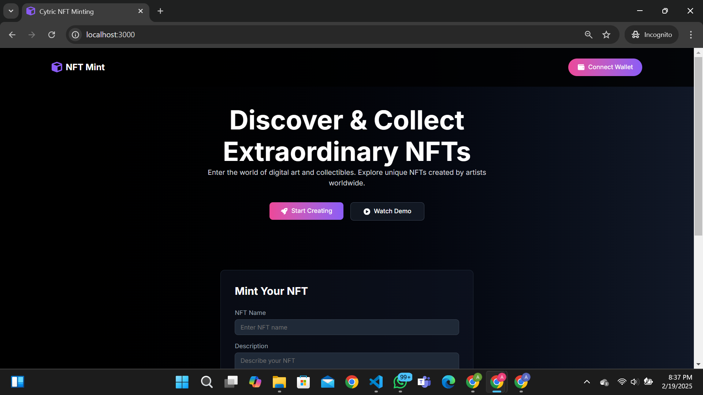
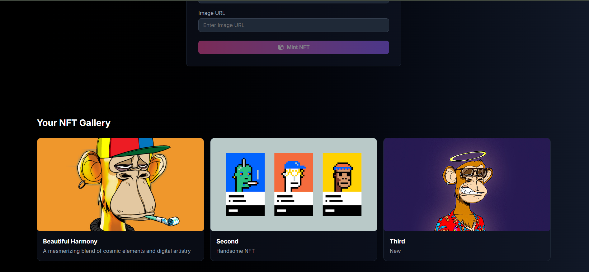
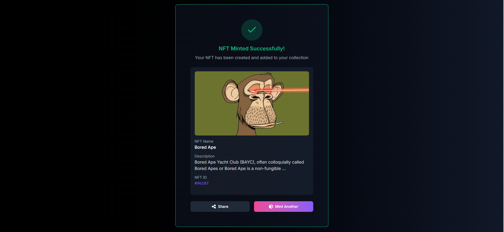
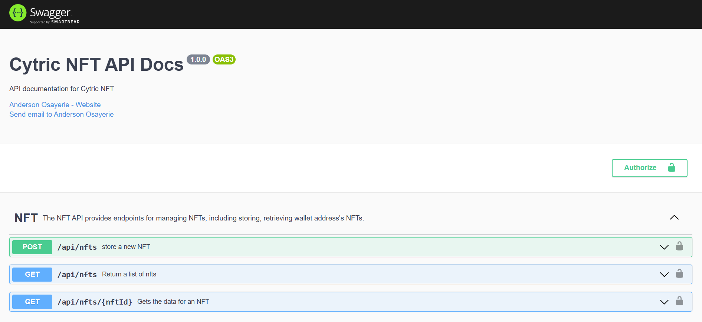

# NFT Mint Application

This is a full stack NFT minting application built using React and Nodejs.

The project also includes a Swagger documentation.

## Table of contents

- [Overview](#overview)
  - [The challenge](#the-challenge)
  - [Screenshot](#screenshot)
  - [Links](#links)
  - [Video Demo](#video-demo)
- [My process](#my-process)
  - [Built with](#built-with)
- [Setting Up](#setup)
- [Documentation](#api-documentation)
- [Author](#author)

## Overview

### The challenge

The task is to seamlessly integrate the provided [figma design](https://www.figma.com/design/fkWRj8xpQv7Ma3SN5eTQHt/NFT-Minting-Page?node-id=0-1&t=AIHR6C8SEpMVbUny-1), into a fully functional web application, demonstrating expertise in full stack web development and web3 integration.


### Screenshot



### Screenshot



### Screenshot




### Links

- Live Site URL: ()
- Live API URL: ()

### Video Demo

- Frontend Demo - ()


### NFT Endpoints

- `POST /api/nfts` - Create an NFT
- `GET /api/nfts?address=${address}` - Find NFTs by wallet address
- `GET /api/nfts/{id}` - Find NFT by ID

## Related Resources

- [Frontend Repository](https://github.com/andemosa/nft-mint/tree/main/frontend)
- [Backend Repository](https://github.com/andemosa/nft-mint/tree/main/server)

## My process

### Built with

- TypeScript
- [Next.js](https://nextjs.org/)
- [Tailwind](https://tailwindcss.com/)
- [Rainbowkit](https://www.rainbowkit.com/)
- [Wagmi](https://wagmi.sh/)
- [SWR](https://swr.vercel.app/)
- [Express](https://expressjs.com/)
- [Zod](https://zod.dev/)

## Setup

This guide will walk you through the process of setting up the NFT Minting App on your local machine.

### Prerequisites

Before you begin, ensure you have Node.js installed on your system.

### Cloning the Repository

Start by cloning the repository to your local machine:

```bash
git clone https://github.com/andemosa/nft-mint.git
cd nft-mint
```

### Backend Configuration

1. **Environment Files**: Navigate to the `server` folder and create an `.env` file using the `.env.example` file.

2. **MongoDB Setup**:

   - Sign up for an account at [MongoDB Atlas](https://www.mongodb.com/cloud/atlas).
   - Create a new cluster and follow the instructions to set up a new database.
   - Once set up, obtain your MongoDB connection string and add it to the `MONGO_URI` variable in your `.env` files.


### Frontend Configuration

1. **Environment Files**: Navigate to the `frontend` folder and create an `.env` file using the `.env.example` file.

2. **NEXT_PUBLIC_BASE_URL**:
   - The `NEXT_PUBLIC_BASE_URL` should point to the URL where your backend application is running (typically `http://localhost:4000` if you're running it locally).

### Running the Application

1. **Backend**:

   - Navigate to the `server` directory.
   - Install dependencies: `npm install`.
   - Start the server: `npm run dev`.

2. **Frontend**:
   - Open a new terminal and navigate to the `frontend` directory.
   - Install dependencies: `npm install`.
   - Start the frontend application: `npm run dev`.
   - The application should now be running on `http://localhost:3000` but verify this in your command line terminal

## API Documentation

The REST API exposes its OpenAPI. You can view the API definition interactively using the Swagger UI, hosted at /docs. Simply start the server and navigate to [http://127.0.0.1:4000/docs](http://127.0.0.1:4000/docs) in your browser to access the Swagger UI.

Alternatively, you can explore the [online version of the API documentation](https://andemosa.github.io/nft-mint/) without running the server.

[](https://andemosa.github.io/nft-mint/)

## Author

- Anderson Osayerie - [@andemosa](https://andemosa.tech)
- Twitter - [@andemosa](https://www.twitter.com/andemosa)
